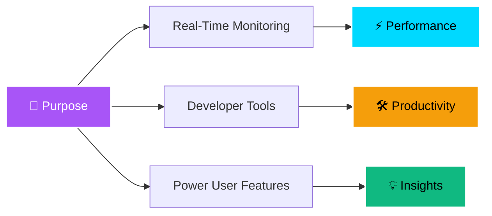

<div align="center">

# ⚡ ZWYX


<p align="center">
  
  
  
  
</p>

### 🚀 A lightweight iOS application for real-time device monitoring


</div>

---

## 📋 Table of Contents

- [🎯 Overview](#-overview)
- [✨ Features](#-features)
- [🚦 Getting Started](#-getting-started)
  - [Prerequisites](#prerequisites)
  - [Installation](#installation)
  - [Usage](#usage)
  - [Testing](#testing)
- [🛠️ Tech Stack](#️-tech-stack)
- [📸 Screenshots](#-screenshots)
- [🤝 Contributing](#-contributing)
- [📄 License](#-license)

---

## 🎯 Overview

<div align="center">

</div>

Zwyx provides **real-time insights** into your iPhone's performance, including **CPU**, **memory**, and **battery metrics**. Designed with **SwiftUI**, it offers a visually adaptable and user-friendly interface tailored for developers and power users alike.

<div align="center">

```swift
let zwyx = SystemMonitor(
    colorful: true,
    gear: .realTimeMetrics,
    monitor: .seamlessExperience,
    tools: .automatedDeployment,
    core: .robustManagement
)
```

</div>

---

## ✨ Features

<table>
<tr>
<td width="50%">

### 🎨 Colorful


Customizable themes to match your workflow and preferences

</td>
<td width="50%">

### ⚙️ Gear


Real-time device monitoring for CPU, memory, and battery

</td>
</tr>
<tr>
<td width="50%">

### 📱 Monitor


Seamless iOS native experience optimized for iPhones

</td>
<td width="50%">

### 🔧 Tools


Automated build scripts streamline deployment

</td>
</tr>
<tr>
<td colspan="2" align="center">

### 💎 Core


Robust binary manager app startup and system interactions

</td>
</tr>
</table>

<div align="center">

</div>

---

## 🚦 Getting Started

### Prerequisites

<div align="center">

| Requirement | Details |
|-------------|---------|
| 📱 **OS** | iOS 15.0+ |
| 🔤 **Language** | Swift 5.9+ |
| 📦 **Package Manager** | swift_package_manager |

</div>

### Installation

<details>
<summary>📥 Click to expand installation steps</summary>

#### 1️⃣ Clone the repository

```bash
git clone https://github.com/Armfy/Zwyx
```

<div align="center">

</div>

#### 2️⃣ Navigate to the project directory

```bash
cd Zwyx
```

#### 3️⃣ Install the dependencies

Using [swift_package_manager](https://swift.org/package-manager/):

```bash
swift build
```

<div align="center">

</div>

</details>

---

### Usage

Run the project with:

Using [swift_package_manager](https://swift.org/package-manager/):

```bash
swift run
```

<div align="center">

</div>

---

### Testing

Zwyx uses the **test_framework** test framework. Run the test suite with:

Using [swift_package_manager](https://swift.org/package-manager/):

```bash
swift test
```

<div align="center">

</div>

---

## 🛠️ Tech Stack

<div align="center">

### Built with the tools and technologies


<br/>


</div>

---

## 🎨 Why Zwyx?

<div align="center">



</div>

This project aims to deliver quick, accessible system information directly on your iPhone. The core values include:

- ⚡ **Fast** - Minimal resource footprint
- 🎨 **Beautiful** - Clean, modern interface
- 🔄 **Real-Time** - Instant metrics updates
- 🛠️ **Powerful** - Advanced monitoring tools

---

## 🤝 Contributing

<div align="center">

Contributions are **always welcome**! 


</div>

1. 🍴 Fork the Project
2. 🔨 Create your Feature Branch (`git checkout -b feature/AmazingFeature`)
3. 💾 Commit your Changes (`git commit -m 'Add some AmazingFeature'`)
4. 📤 Push to the Branch (`git push origin feature/AmazingFeature`)
5. 🎉 Open a Pull Request

---

## 📄 License

<div align="center">

This project is licensed under the **GNU General Public License v3.0**


See `LICENSE` file for more information.

</div>

---

## 📊 Project Stats

<div align="center">


</div>

---

<div align="center">

### 📱 Built with ❤️ for iOS developers


[](# )

</div>
